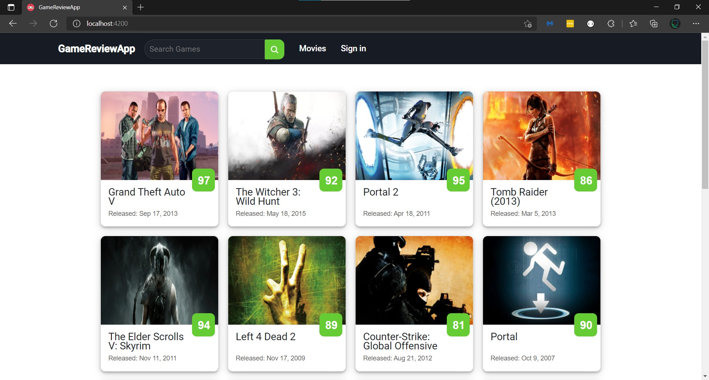
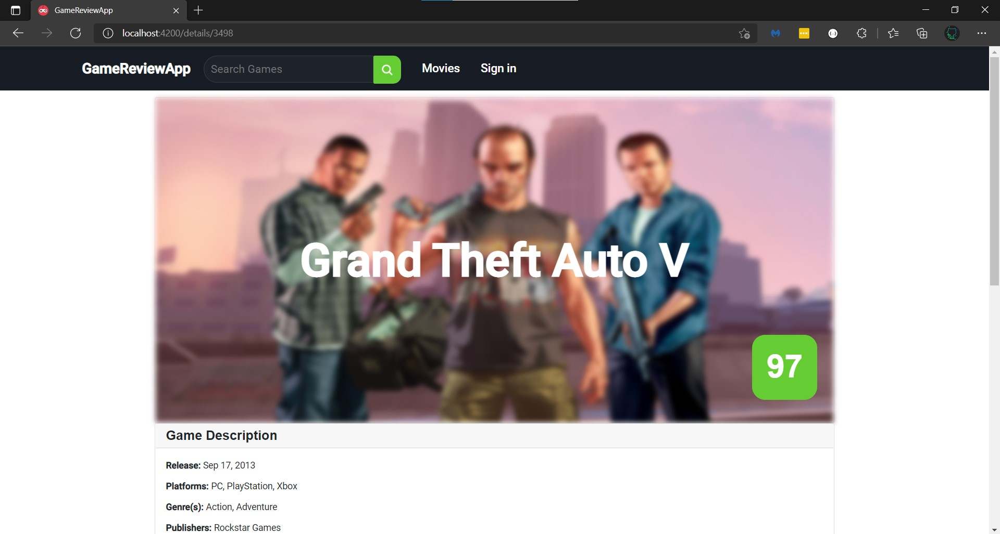
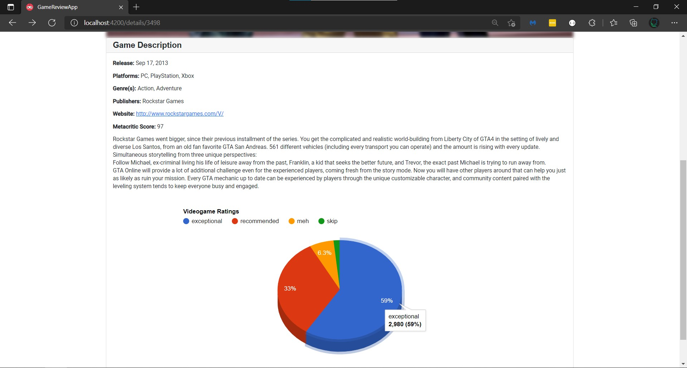
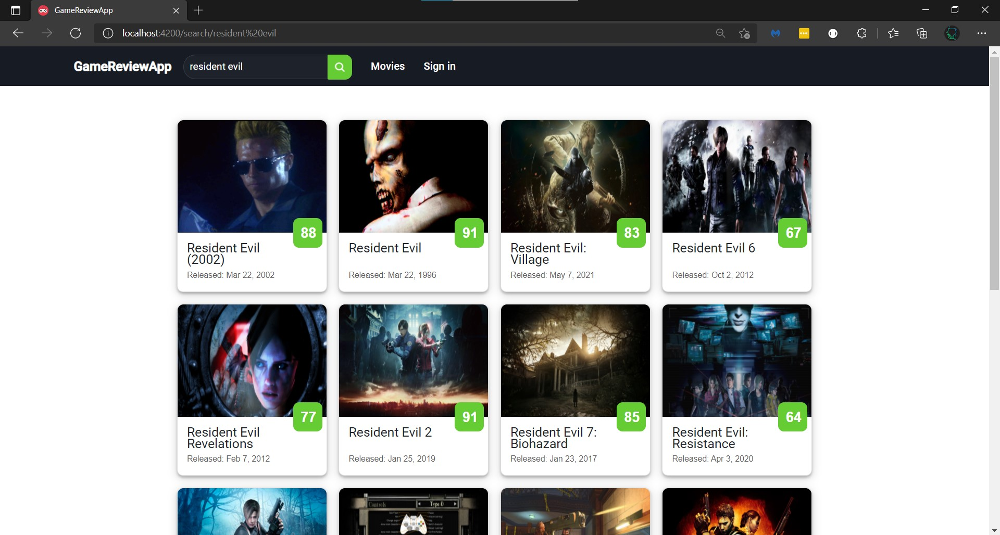
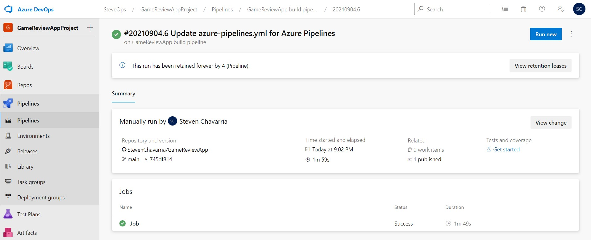

# Gamereviewapp

As a passionate about video games, I like to know the ratings of these to make the best decisions when buying one and what better way to see those ratings on a website that shows the ratings of 350,000+ video games as well as details of them such as release date, description, Metacritic score, platforms, among others. This website also has a section of movies and login that I'm looking to include in the future.

## Information about the Project
This project use:

- Angular CLI (https://github.com/angular/angular-cli) version 12.1.2.

- RAWG Video Games Database API: https://rawg.io/apidocs

- Google charts https://developers.google.com/chart

- Rxjs https://rxjs.dev/ version 6.6.0. 

- Bootstrap https://getbootstrap.com/ 5.1.0.

## How to run

Run `npm install` to install the required dependencies

Run `ng serve` for a dev server and navigate to `http://localhost:4200/`.

## Screenshots

Main page

Details page

Search example

## Use of Azure DevOps for CI

Azure Devops Organization (Public project): https://dev.azure.com/SteveOps/GameReviewAppProject/_build

